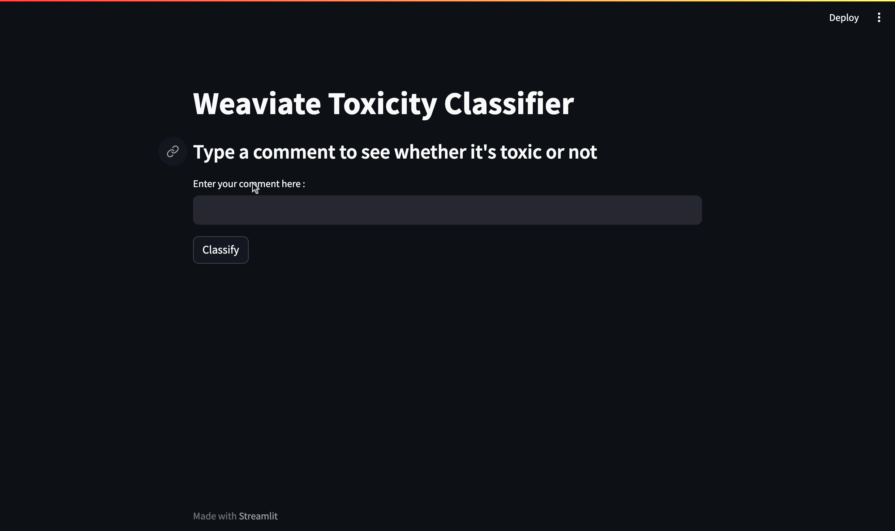

# Toxic Comment Classifier

This project's origin is [here](https://github.com/weaviate/weaviate-examples/tree/main/weaviate-toxic-comment-classifier).

## Overview


In this project, you'll discover the power of semantic search. 
First, we will index the Toxic Comment Classification dataset in Weaviate. 
This dataset comprises two columns: a comment and a binary label indicating whether it is toxic or not. 
When a user enters a comment and wants to determine if it is toxic or not, 
we will conduct a semantic search and display the label of the comment that is most similar to the entered one.

## Technology stack
- Python
- Weaviate
- Streamlit

## Prerequisites
1. Python3 interpreter installed
1. Ability to execute docker compose 
(The most straightforward way to do it on Windows/Mac is to install 
[Docker Desktop](https://www.docker.com/products/docker-desktop/))

## Setup instructions 
1. Clone the repository
1. Create a virtual environment and activate it
    ```shell
    python3 -m venv venv
    source venv/bin/activate
    ```
1. Install all required dependencies 
    ```shell
    pip install -r requirements.txt
    ```
1. Run containerized instance of Weaviate. It also includes vectorizer module to compute the embeddings.
    ```shell
    docker compose up
    ```
1. Index the dataset in Weaviate
    ```shell
    python add_data.py
    ```
1. Run the Streamlit demo
   ```shell
   streamlit run app.py
   ```

## Dataset license

The dataset used for this example is available on Kaggle: 
https://www.kaggle.com/datasets/akashsuper2000/toxic-comment-classification
